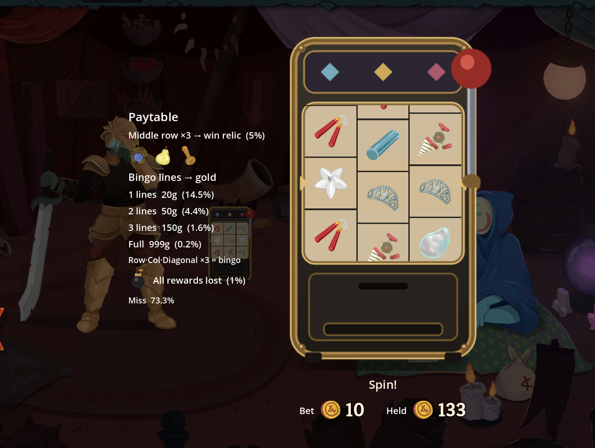

# Lucky Relic Reels

A **Slay the Spire 2** mod that drops a **cabinet of spinning reels** into the merchant's shop. Pull the lever, spend a little gold, and try your luck for **gold — or a free relic**. Pure fun, no balance pretense: it's tuned to *slowly* lose (RTP ~95%) while still raining rewards on you.

[한국어 README](README.ko.md)



---

## What it does

- **A cabinet stands in the shop**, between you and the merchant. Click it to open the machine; **pull the lever** (drag it down or just click) to spin. Each spin costs a fixed **10 gold**.
- **The reels are real relic icons.** The symbols are the shop's **3 relics on sale** (winnable) mixed with a set of **vanilla relics that aren't sold here** (fillers), plus one **bomb**.
- **3×3 grid, bingo scoring.** Rows, columns and diagonals that line up three matching symbols count as bingo lines. You win gold by the **number of lines**:

  | Lines | Gold | Odds |
  |------:|-----:|-----:|
  | 1 line | 20 | 14.5% |
  | 2 lines | 50 | 4.4% |
  | 3 lines | 150 | 1.6% |
  | Full grid | 999 | 0.2% |

- **Win a relic — for free.** If the **middle row (the payline)** shows three of the *same shop relic*, you're granted that relic at **no cost**, and it's removed from the shop. (5% chance.) If you own a relic that keeps the shop stocked, the slot **refills** with a fresh relic and the reel updates.
- **The bomb voids everything.** If the bomb symbol appears (1%), all rewards for that spin are lost — and it **explodes**, scattering your piled-up coins.
- **Predetermined odds.** Outcomes are drawn from a fixed probability table (so the odds are *exact and shown in the paytable*), then the grid is built to display them — a "weighted-outcome" slot rather than an emergent-random one. Overall RTP ≈ 95% (expected ~9.5 gold back per 10 bet).

## The juice

- **Winning rains rewards.** Coins (one per 10 gold) or the won relic's icon **erupt upward like a fountain**, fall with gravity, and **pile at the bottom of the screen** without overlapping. They stay ~1 minute, then fade.
- **The pile is interactive.** Sweep your mouse through the coins to roll them around; click-drag to pick one up and throw it. Coins are clamped to the screen — nothing flies off-edge.
- **The bomb blast** flashes the screen red, throws a fireball, and blows the coin pile apart.

## Co-op (multiplayer)

The two players' machines are **linked**, with interactions that only exist with a partner:

- **Shared pool.** Every spin's bet (from either player) feeds one **shared pot** that both of you watch
  climb. On ~5% of spins you win the **whole pot** — then it resets and starts building again. It carries
  over across every shop for the run.
- **Win from either shop.** Merchant stock is per-player, but your reels can also win the relics on sale
  in **your partner's** shop.
- **…and it's taken from them.** When you win a relic that was in your partner's shop, it **vanishes from
  their merchant** (they get a heads-up banner). First to spin it wins it.
- **Shared jackpot relic.** The rare 999-gold jackpot relic is **one per party** — once either of you
  lands it, it's gone from both machines' reels.

## Options (ModConfig)

- **Skip win/bomb effects** — grants and gold still pay out; only the fountain / explosion visuals are skipped.
- **Skip reel-spin animation** — results appear instantly, no spinning.

## Notes

- **Not a balance mod** — it's a casual, for-fun gambling toy. It leans slightly in the house's favor but keeps handing out gold and the occasional free relic.
- **Co-op supported**, with linked-machine interactions (see above). Each player spins on their own screen; payouts replicate to your partner. Both players need the mod (same version).
- **Doesn't touch your run's RNG.** The slot uses an independent random generator, so it never disturbs card / relic / map rolls or save-scumming.
- Languages: English, 한국어, 简体中文.

## Dev console

With mods loaded, open the console (backtick) and use:

- `slot [relic|1|2|3|full|bomb|lose]` — open the machine anywhere and force the next spin's outcome (for testing each reward / animation).
- `slot courier` — grant **The Courier** (which keeps the shop stocked) so you can verify the reel refills after winning a relic.

## Installation

1. Subscribe on the Steam Workshop, or download the latest release.
2. If installing manually, place the `Sts2SlotMachine/` folder into `<Slay the Spire 2 install>/mods/` (with `Sts2SlotMachine.dll`, `.json`, and the loose `.png` art).
3. Launch the game and visit a merchant.

## Building from source

Requirements: .NET SDK, Godot.NET.Sdk 4.5.1 (auto-resolved), a local Slay the Spire 2 install, and the sibling `Sts2.ModKit` project alongside this one.

```sh
dotnet build Sts2SlotMachine.csproj -c Debug
```

## License

MIT — see [LICENSE](LICENSE). Built on Slay the Spire 2 by MegaCrit.
